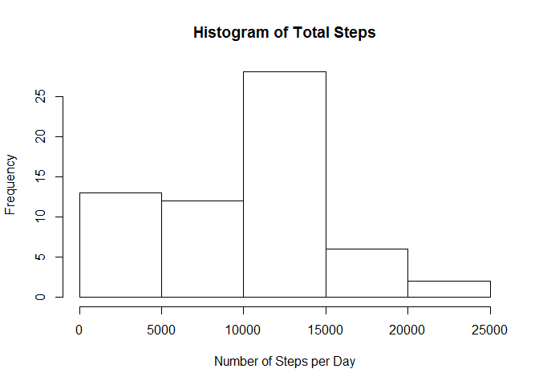
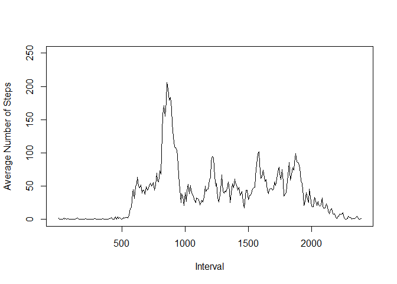
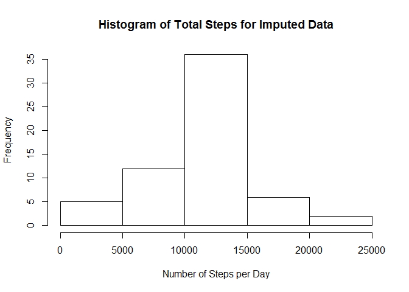
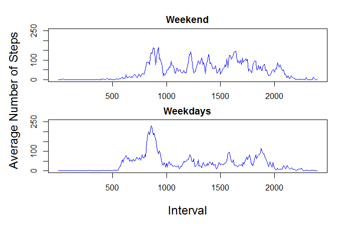

# Reproducible Research: Peer Assessment 1


### Loading and preprocessing the data

```r
# downlod file if not present
library(dplyr)
if (file.exists('activity.zip')==FALSE){
    u <- 'https://d396qusza40orc.cloudfront.net/repdata%2Fdata%2Factivity.zip'
    download.file(u,destfile='./activity.zip')
}
# unzip and read the dataset
afile <- unzip('activity.zip')
ac <- read.csv(afile)
```

### What is mean total number of steps taken per day?

```r
# split by date and apply sum to all ignoring NAs
sac <- split(ac$steps,ac$date)
sumac <- sapply(sac,sum,na.rm=TRUE)
hist(sumac,main='Histogram of Total Steps',xlab='Number of Steps per Day')
```

 

```r
meansumac <- mean(sumac)
mediansumac <- median(sumac)
```

#### Mean number of steps per day is 9354.23.
#### Median number of steps per day is 10395.

### What is the average daily activity pattern?

```r
# split steps based on interval and apply mean
ac <- arrange(ac,interval)
sac <- split(ac$steps,as.factor(ac$interval))
meanac <- sapply(sac,mean,na.rm=TRUE)
namesac <- c('500','1000','1500','2000')
plot(meanac,type='l',xlab='Interval',ylab='Average Number of Steps',xaxt='n',ylim=c(0,250))
axis(1,at=sapply(namesac,function(i) which(names(meanac)==i)),labels=namesac)
```

 

```r
meanac <- unlist(meanac)
maxac <- max(meanac)
maxname <- names(meanac)[which(meanac==maxac)]
```

#### 835 interval contains the maximum number of average steps, as seen also in the figure above.

### Imputing missing values

```r
# get NAs
nona <- sum(is.na(ac$steps))
```

#### There are 2304 number of missing values in the dataset.


```r
# impute NAs based on average value for the interval
# group by interval and mutate steps based on mean of the group
gai <- group_by(ac,interval)
ac2 <- mutate(gai,steps=ifelse(is.na(steps),as.integer(mean(steps,na.rm=TRUE)),steps))
ac2 <- ungroup(ac2)
```

### Are there changes in distribution after imputing the data?

```r
# split by date and calc. sum
sac2 <- split(ac2$steps,as.factor(ac2$date))
sumac2 <- sapply(sac2,sum)
hist(sumac2,main='Histogram of Total Steps for Imputed Data',xlab='Number of Steps per Day')
```

 

```r
meansumac2 <- mean(sumac2)
mediansumac2 <- median(sumac2)
```

#### Mean number of steps per day is 10749.77.
#### Median number of steps per day is 10641.
#### Imputing NAs in the dataset led to an increase in the number of steps for different intervals as reflected on the distribution, as well as mean and median values.

### Are there differences in activity patterns between weekdays and weekends?

```r
# generate weekend and weekdays values and group data by this category
ac3 <- mutate(ac2,week=ifelse(weekdays(as.Date(date))=='Saturday' | weekdays(as.Date(date))=='Sunday','weekend','weekday'))
ac3$week <- as.factor(ac3$week)
# split steps based on interval and apply mean
ac3 <- arrange(ac3,interval)
ac3we <- filter(ac3,week=='weekend')
ac3wd <- filter(ac3,week=='weekday')
sac3we <- split(ac3we$steps,as.factor(ac3we$interval))
meanacwe <- sapply(sac3we,mean)
sac3wd <- split(ac3wd$steps,as.factor(ac3wd$interval))
meanacwd <- sapply(sac3wd,mean)
par(mfrow=c(2,1),mar=c(2,0,2,0),oma=c(5,5,1,1))
plot(meanacwe,type='l',main='Weekend',xaxt='n',xlab='',ylab='',col='blue',ylim=c(0,250))
axis(1,at=sapply(namesac,function(i) which(names(meanacwe)==i)),labels=namesac)
plot(meanacwd,type='l',main='Weekdays',xaxt='n',xlab='',ylab='',col='blue',ylim=c(0,250))
axis(1,at=sapply(namesac,function(i) which(names(meanacwd)==i)),labels=namesac)
mtext('Average Number of Steps',side=2,outer=TRUE,line=3,cex=1.5)
mtext('Interval',side=1,outer=TRUE,line=1.5,cex=1.5)
```

 

#### The activity pattern in weekends seem to be very different from weekdays, based on the number of steps. There is more steps in later time intervals in weekends compared to weekdays.

